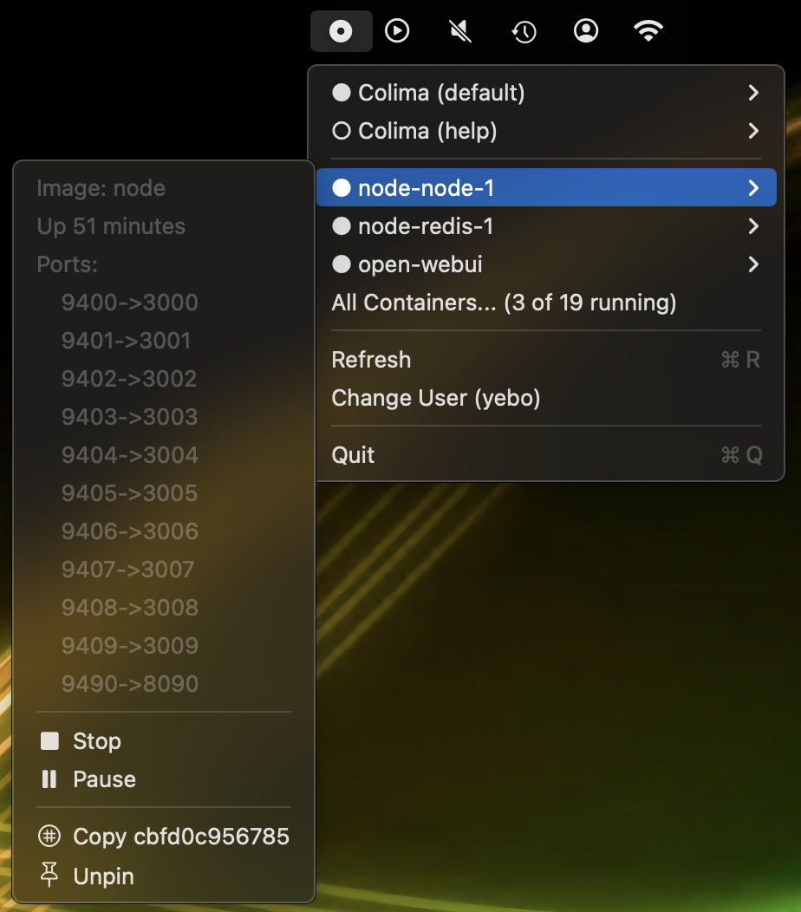
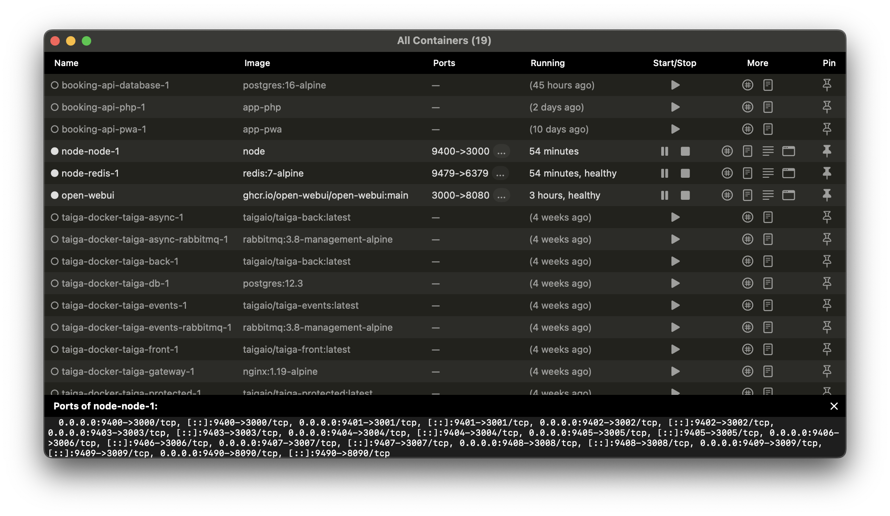

# CD Player

**Colima Docker Player** — a lightweight, native macOS menu bar app for managing [Colima](https://github.com/abiosoft/colima) instances and Docker containers.



## Features

### Colima Management
- Menu bar icon showing Colima status at a glance
- Discover Colima profiles automatically
- Start and stop Colima directly from the menu bar
- View instance details: CPUs, memory, disk

### Docker Containers
- Discover Docker containers automatically
- Running containers are auto-pinned to the menu 
- Start, stop, pause containers
- *All Containers* window for full overview and control
- Container inspect and log shortcuts
- Open interactive shell for running containers
- Pin/unpin containers for quick access



### Optional Multi-User Support
- Run Colima as a service for multiple user accounts
- Define main user's Colima instance to share
- User switch via `sudo` and Terminal

## Requirements

- macOS 13.0+
- [Colima](https://github.com/abiosoft/colima) installed (`brew install colima`)

## Installation

### Download

Download the latest DMG from the [Releases](../../releases) page and drag **CD Player.app** to your Applications folder.

### Build from Source

```bash
git clone https://github.com/bblaette/cd-player.git
cd cd-player
./build-app.sh
open "CD Player.app"
```

## Usage

CD Player runs as a menu bar app (no dock icon). Click the menu bar icon to:

- See Colima status and start/stop controls
- See pinned Docker containers with quick actions
- Open the full container list with *All Containers...*

### Configuration

Settings are stored in `~/.config/cd-player/config.json`:

- **Colima User** — set via the "Change User" menu item. When set to a different user, Colima commands run via `sudo -Hu <user>`.
- **Auto-Fix Socket Permissions** — automatically runs `chmod g+rw` on the docker socket after Colima starts (useful for multi-user setups).

### Keyboard Shortcuts

| Shortcut | Action |
|----------|--------|
| S | Start/Stop Colima |
| R | Refresh |
| Q | Quit |

## Credits

- CD Player is based on the very neat [Colimabar](https://github.com/tdi/colimabar) by [tdi](https://github.com/tdi)
- This application was written with assistance from [Claude Code](https://github.com/anthropics/claude-code), Opus 4.6

## License

MIT License — see [LICENSE](LICENSE) for details.
